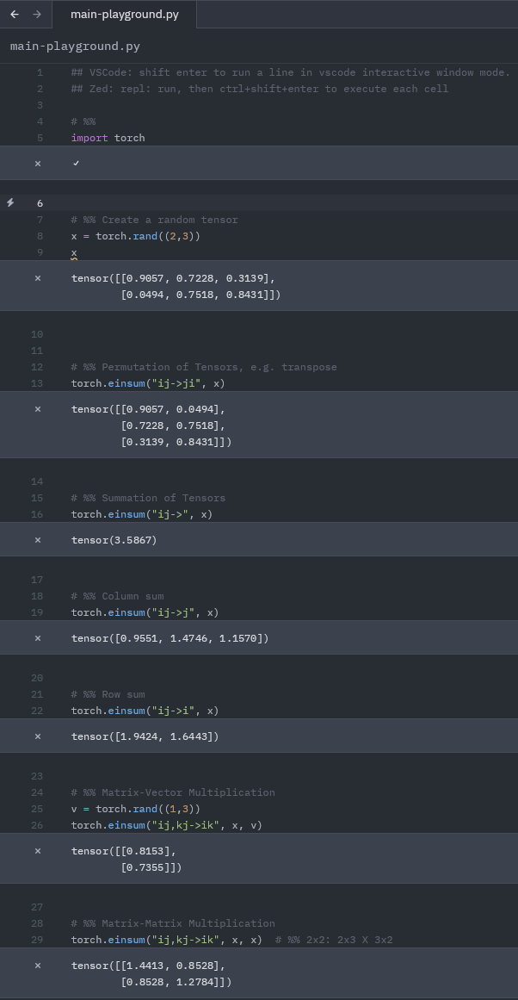
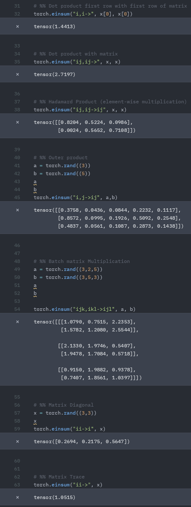

#  Einsum playground
---

- Yet another exploration of [einsum](https://pytorch.org/docs/stable/generated/torch.einsum.html) in pytorch.
- Also demonstrates the notebook cell facility to display results using the amazing [Zed editor](https://github.com/zed-industries/zed?tab=readme-ov-file#zed).


Benefits:
- The same notation should (mostly) work across libraries.


## Example:






## Annotated Exampe


#### Permutation of Tensors, e.g. transpose
```python
torch.einsum("ij->ji", x)
```

#### Summation of Tensors
```python
torch.einsum("ij->", x)
```

#### Column sum
```python
torch.einsum("ij->j", x)
```

#### Row sum
```python
torch.einsum("ij->i", x)
```


#### Matrix-Vector Multiplication
```python
v = torch.rand((1,3))
torch.einsum("ij,kj->ik", x, v)
```


#### Matrix-Matrix Multiplication
```python
torch.einsum("ij,kj->ik", x, x)  # %% 2x2: 2x3 X 3x2
```


#### Dot product first row with first row of matrix
```python
torch.einsum("i,i->", x[0], x[0])
```


#### Dot product with matrix
```python
torch.einsum("ij,ij->", x, x)
```

#### Hadamard Product (element-wise multiplication)
```python
torch.einsum("ij,ij->ij", x, x)
```

#### Outer product
```python
a = torch.rand((3))
b = torch.rand((5))
a
b
torch.einsum("i,j->ij", a,b)
```

#### Batch matrix Multiplication
```python
a = torch.rand((3,2,5))
b = torch.rand((3,5,3))
a
b

torch.einsum("ijk,ikl->ijl", a, b)
```


#### Matrix Diagonal
```python
x = torch.rand((3,3))
x
torch.einsum("ii->i", x)
```

#### Matrix Trace
```python
torch.einsum("ii->", x)
```
